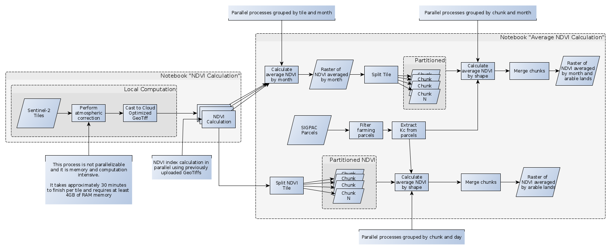

# Cloudbutton Geospatial Use Case Workflows

## Workflows
- [NDVI](./NDVI.ipynb): It gets tiles captured by Sentinel-2 and performs atmospheric correction. Then, coumputes NDVI (Normalized Difference Vegetation Index). Finally, it processes the calculated NDVI indexes to compute averages by shape and month.



- [Water Consumption](./WaterConsumption.ipynb): It computes water consumption of crop fields based on temperature and solar irradiance.


## Setup:

*Note*: These notebooks have been developed using Python3.7 - other Python versions might not work.

1. Install [Lithops Serverless Framework](https://github.com/lithops-cloud/lithops)

2. Setup local Python virtual environment:
    ```
    $ python3.7 -m venv venv
    $ source venv/bin/activate
    $ (venv) pip install -r requirements
    ```
    
3. Setup Jupyter notebook kernel.
    ```
    $ (venv) ipython kernel install --name "geospatial" --user
    $ (venv) jupyter nbextension enable --py --sys-prefix widgetsnbextension
    $ (venv) jupyter nbextension enable --py --sys-prefix ipyleaflet
    ```

4. Start local Jupyter Notebook:
    ```
    $ (venv) jupyter notebook
    ```

5. Follow further instructions listed in each notebook.

## Authors

- Answare:
    - Tonny Velin (tvelin@answare-tech.com)
    - Pablo David Muñoz (jlozano@answare-tech.com)
    - Cristina Castillo García
    - Carlos A. Pineda Martínez

- Universitat Rovira i Virgili
    - Aitor Arjona Pérez (aitor.arjona@urv.cat)

